# python-programs

My python practice programs

---

## Program 1
**Code:** `program1.py`  
**Output:**  
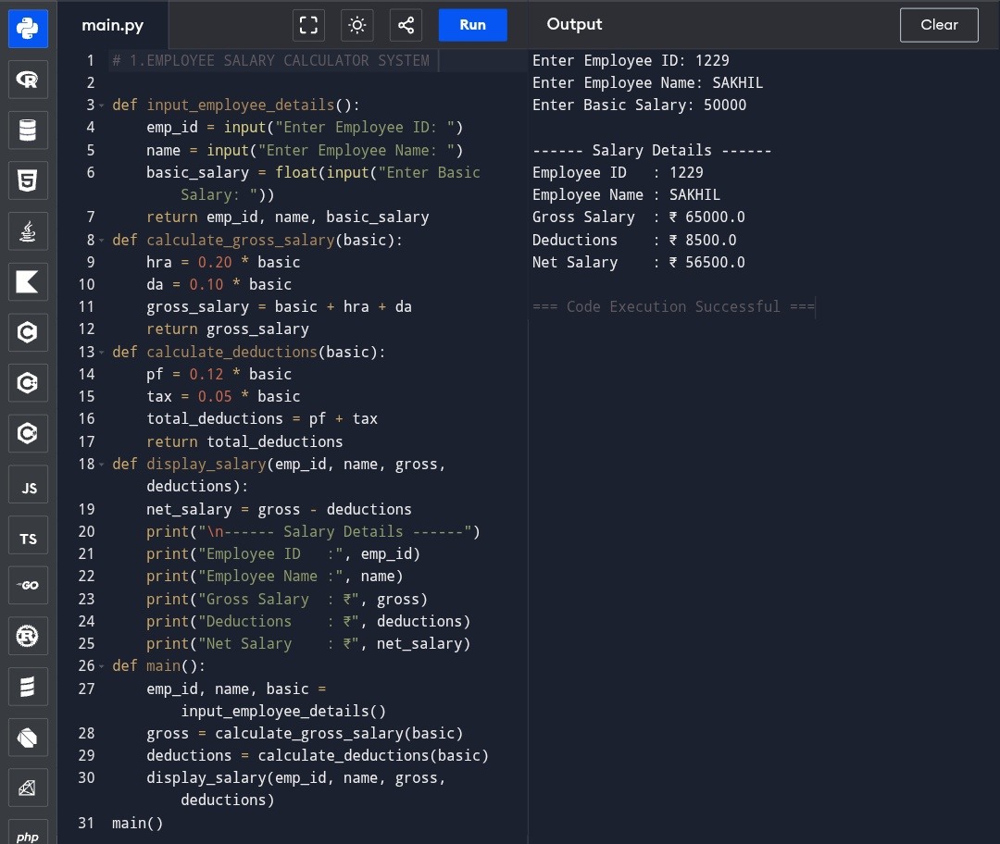

---

## Program 2
**Code:** `program2.py`  
**Output:**  
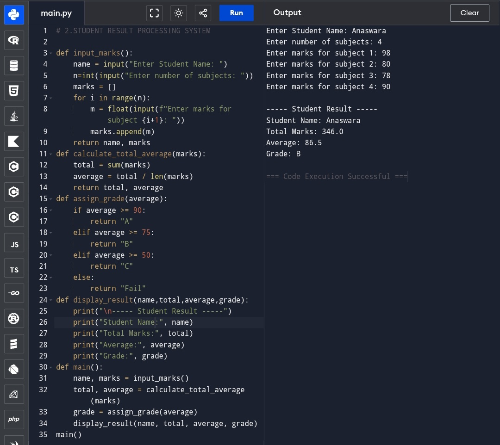

---

## Program 3
**Code:** `program3.py`  
**Output:**  
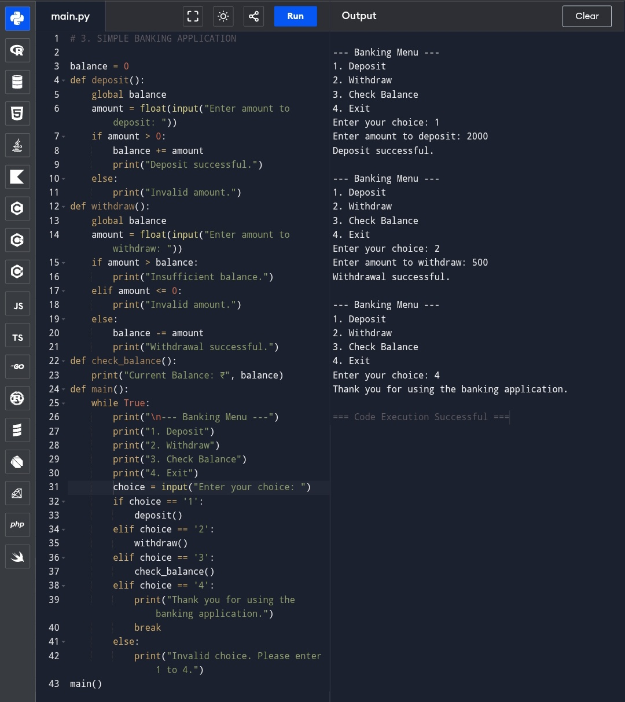

---

## Program 4
**Code:** `program4.py`  
**Output:**  
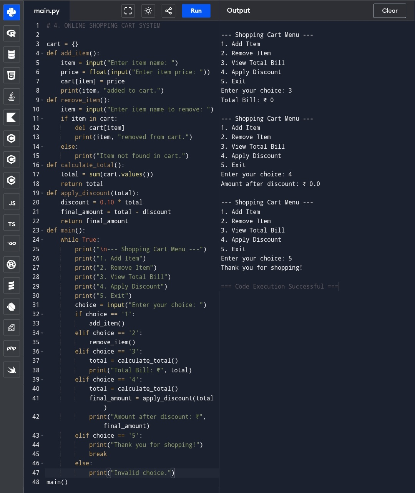

---

## Program 5
**Code:** `program5.py`  
**Output:**  
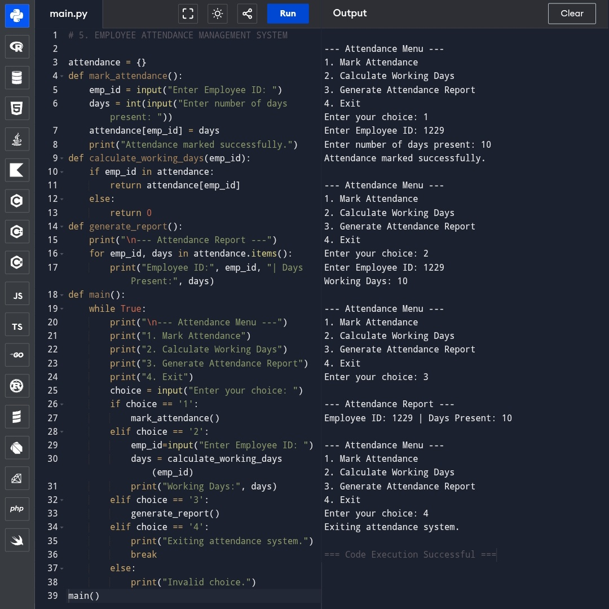

---

## Program 6
**Code:** `program6.py`  
**Output:**  
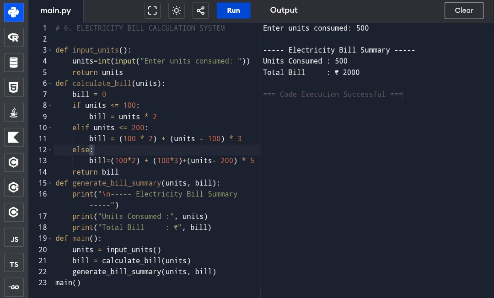

---

## Program 7
**Code:** `program7.py`  
**Output:**  
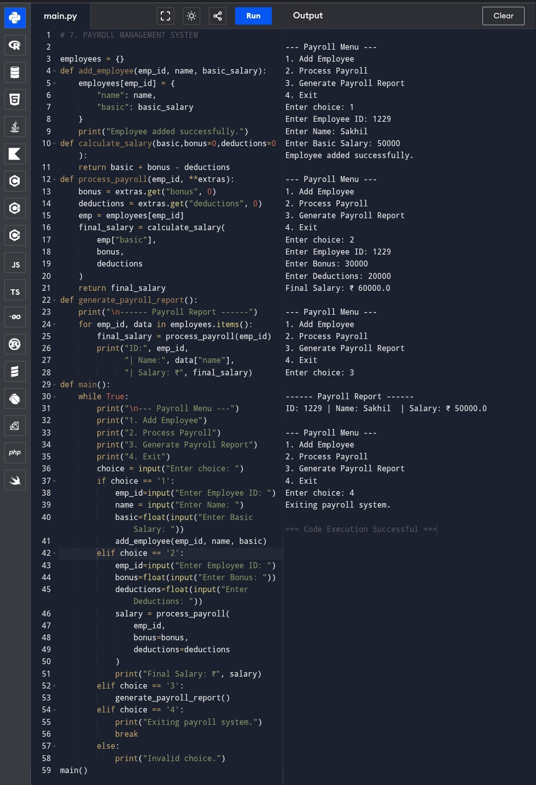

---

## Program 8
**Code:** `program8.py`  
**Output:**  
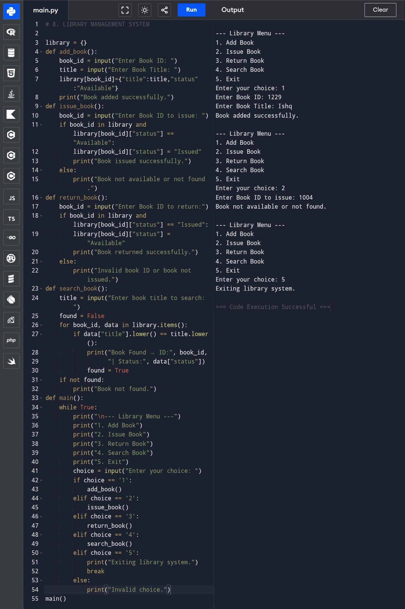

---

## Program 9
**Code:** `program9.py`  
**Output:**  
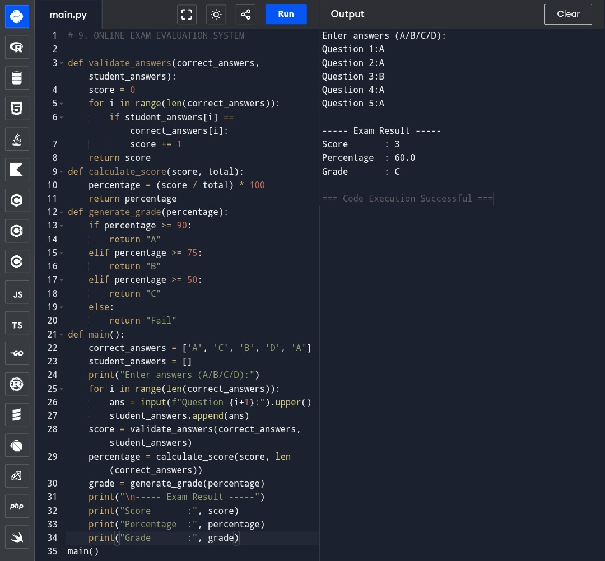

---

## Program 10
**Code:** `program10.py`  
**Output:**  
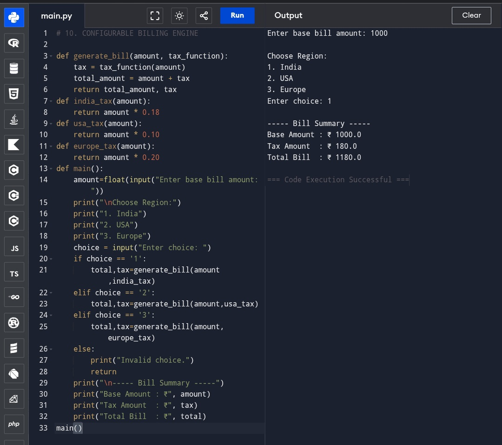

---

## Program 11
**Code:** `program11.py`  
**Output:**  
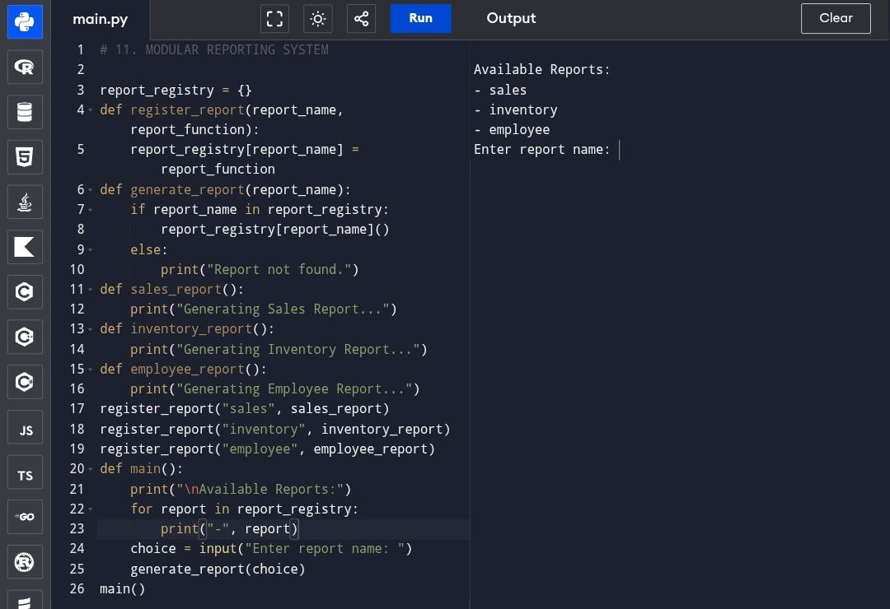

---

## Program 12
**Code:** `program12.py`  
**Output:**  
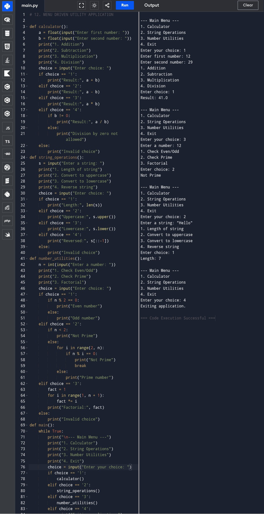
